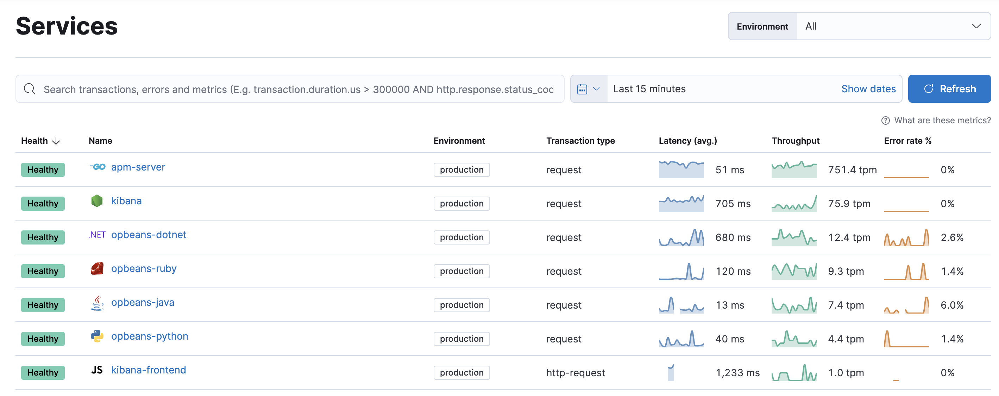
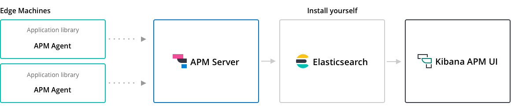
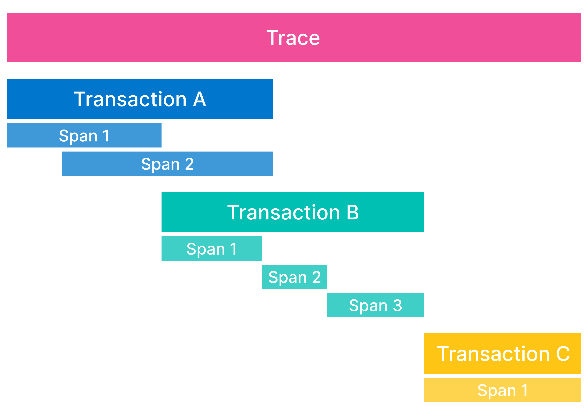

# Application performance monitoring (APM)

APM của Elastic là một giải pháp giám sát hiệu suất ứng dụng được phát triển bởi Elastic. Elastic APM giúp theo dõi, ghi lại và thu thập thông tin hiệu suất của ứng dụng trong thời gian thực bằng cách thu thập thông tin hiệu suất cho các incoming requests, database queries, external HTTP requests ... Điều này giúp dễ dàng xac định và khắc phục các vấn đề về hiệu suất 1 cách nhanh chóng

Elastic APM bao gồm các thành phần chính sau:

- APM Agent: Được nhúng vào ứng dụng của bạn (Hỗ trợ nhiều ngôn ngữ như Java, NodeJS, Python, Ruby, .NET ...) để thu thập dữ liệu về truy cập và hiệu suất

- APM Server: Nhận dữ liệu từ các APM agent, chuyển đổi và gửi dữ liệu này tới Elasticsearch

- Kibana: Cung cấp giao diện người dùng để xem được biểu đồ và phân tích dữ liệu về hiệu suất của ứng dụng

Lợi ích: 

- Theo dõi thời gian phản hồi và hiệu suất của các API/request và dịch vụ

- Phát hiện các lỗi trong ứng dụng và điể nghẽn về hiệu suất của ứng dụng

- Phân tích các request để tối ưu hóa hiệu suất

> ElasticAPM là công cụ hữu ích cho việc giám sát và tối ưu hóa hiệu suất của ứng dụng, giúp cải thiện trải nghiệm của người dùng và đảm bảo ứng dụng hoạt động tốt

# Apllication Data Type

Trong Elastic APM, Application Data Type là kiểu dữ liệu thu thập từ các ứng dụng để phân tích và giám sát hiệu suất. Dữ liệu này được phân loại thành các loại chính như sau:

- **Transactions**: Đại diện cho một đơn vị hoạt động của ứng dụng, thường là một request API hoặc một luồng xử lý trong ứng dụng. Mỗi transaction ghi lại các thông tin như thời gian bắt đầu, thời gian kết thúc, và các bước thực hiện bên trong. Transaction giúp xác định thời gian phản hồi của từng thành phần trong ứng dụng

- **Spans**: Là các đơn vị nhỏ hơn bên trong một Transaction, ghi lại các thao tác, yêu cầu phụ. Ví dụ, nếu transaction là một API call, thì span có thể là các truy vấn đến cơ sở dữ liệu, request tới một dịch vụ khác, hoặc có thể là thao tác với 1 tập tin (chạy script ...) trong quá trình thực hiện API đó. Spans giúp chi tiết hóa các bước của Transaction để phát hiện điểm nghẽn

- **Errors**: Chứa thông tin về lỗi xảy ra trong ứng dụng. Mỗi lỗi ghi lại chi tiết như loại lỗi, thông điệp lỗi và vị trí xảy ra cho phép ta tìm và khắc phục lỗi 1 cách nhanh chóng

- **Metrics**: Là các chỉ số giám sát hệ thống như CPU, RAM, I/O và latency. Các metric giúp theo dõi tài nguyên hệ thống

- **Traces**: Là một tập hợp các Transactions liên quan đến một hoạt động lớn trong ứng dụng, có thể bao gồm nhiều dịch vụ hoặc quy trình nhỏ bên trong. Ví dụ một trace có thể là toàn bộ quá trình xử lý 1 request của người dùng. Từ khi request gửi tới hệ thống đến khi nhận được response (Khi một request được gửi vào hệ thống, Elastic APM sẽ tạo ra 1 trace duy nhất cho toàn bộ quá trình này. Trace sẽ chứa nhiều transactions và spans để ghi lại chi tiết các bước của request, giúp xác định thời gian xử lý)

> Các loại dữ liệu trên được gửi từ APM Agents tới APM Server, sau đó được lưu trữ trong Elasticsearch để phân tích và hiên thị thông qua Kibana

# Troubleshooting

## What happens when APM Server or Elasticsearch is down?

https://www.elastic.co/guide/en/observability/current/apm-server-es-down.html

> Giải pháp, sử dụng redis hoặc kafka làm bộ đệm tạm thời, filter các message có contain "ERR", "CRITICAL" và push những message này tới redis hoặc kafka, sau đó dùng Logstash để đọc dữ liệu từ kafka/redis và đẩy về ElasticSearch (cần cài thêm kafka/redis và logstash)

## APM Response code

HTTP 503: Request timed out waiting to be processed

https://www.elastic.co/guide/en/observability/current/apm-common-response-codes.html#apm-request-timed-out

Điều này xảy ra khi APM server vượt quá lượng request tối đa mà nó có thể xử lý đồng thời. Đề giải quyết vấn đề này có thể thử `reduce the sample rate and/or reduce the collected stack trace information`

https://www.elastic.co/guide/en/observability/current/apm-reduce-apm-storage.html

> Cách giải quyết tốt nhất là tăng số lượng APM Server instances

## Monitor APM server

- Internal collection

- Metricbeat collection

- Local collection

https://www.elastic.co/guide/en/observability/current/apm-monitoring.html

## Processing & Performance

Hiệu suất của APM trên 1 số hardware cloud:

https://www.elastic.co/guide/en/observability/current/apm-processing-and-performance.html

